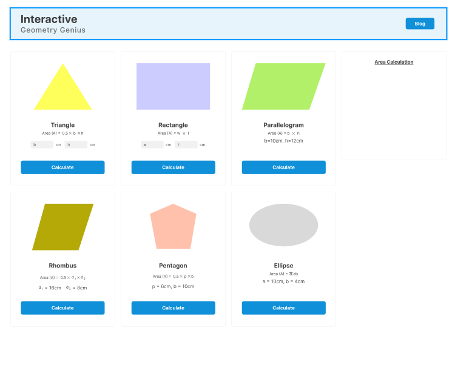
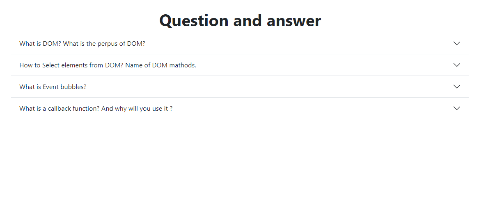

# Github private repository link:
```
https://github.com/programming-hero-web-course2/b7a5-geometry-genius-assignment-antik1801
```
# Netlify Link:
```
https://ornate-jalebi-3f839e.netlify.app
```
# Github MyAccount Link:
```
https://github.com/antik1801/geometry_calculations
```
# Screen Shots:





# geometry-genius-resources

### Click here to [Create Private Repo](https://classroom.github.com/a/6nRSQFlh)
Private Repo Link: [https://classroom.github.com/a/6nRSQFlh](https://classroom.github.com/a/6nRSQFlh)

